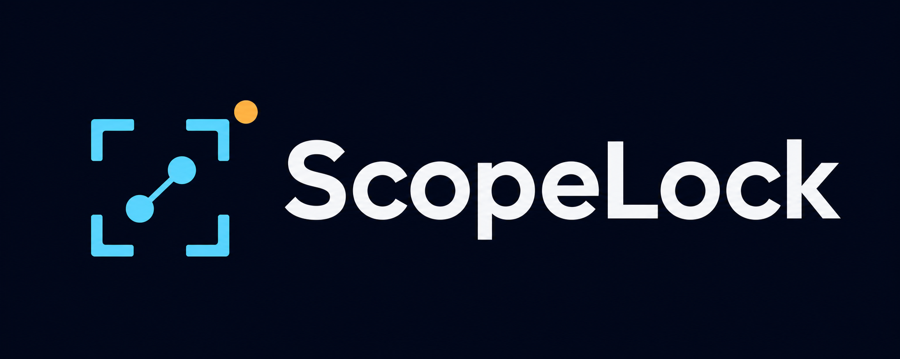
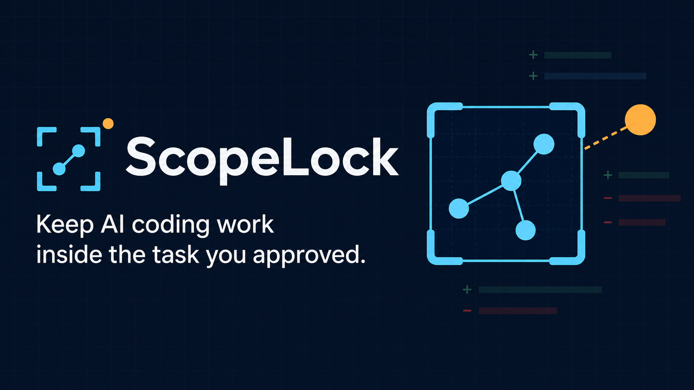

<p align="center">
  
</p>

# ScopeLock

Keep AI coding work inside the task you approved.

ScopeLock is a local-first Codex plugin that records an explicit task boundary, captures the current Git state, and reports later changes as in scope, out of scope, pre-existing, amended, or uncertain.

> ScopeLock detects and warns. It is not a sandbox and does not block every write.



## Why it exists

Coding tasks rarely start in a perfectly clean repository. A worktree may already contain user edits, generated files, another agent's changes, or commits created after the task began. A raw diff cannot answer which changes belong to the approved task.

ScopeLock gives Codex a durable, reviewable boundary:

- a concrete objective;
- exact allowed files or directory prefixes;
- optional forbidden paths and constraints;
- an immutable Git Baseline;
- explicit validation requirements;
- evidence-labeled Status and Verify results.

## Three workflows

### Lock

Ask Codex:

```text
Lock this task to src/auth/ and tests/auth/.
```

ScopeLock inspects the repository, requires a concrete objective and exact scope, then writes the approved contract under `.codex-scope/`.

### Status

Ask Codex:

```text
Are we still inside the scope I approved?
```

Status is read-only. It compares the live Git state with the active Baseline and does not run tests, approve paths, or update evidence.

The normal result is deliberately short: what looks right, what needs attention, what was already dirty, and one next action. Ask for details to see Lock IDs, evidence labels, matching rules, and the full categorized comparison.

### Verify

Ask Codex:

```text
Verify the task against its ScopeLock boundary.
```

Verify creates an immutable report. Required commands are never treated as authorized merely because they appear in the Lock. Codex must show the exact command and receive separate approval before running it.

Verify starts with the same plain-language summary while preserving the full labeled evidence in its local report.

Verification does not close the Lock automatically.

## What the results mean

| Result | Meaning |
|---|---|
| `in-scope` | A post-Lock change matches an approved rule |
| `out-of-scope` | A post-Lock change matches a forbidden rule or no allowed rule |
| `pre-existing` | The path already differed at Baseline capture |
| `approved-amendment` | A later explicit amendment covers the path |
| `late-approved` | The finding existed before approval and remains visible |
| `uncertain` | Available evidence cannot support a stronger claim |

Material statements are labeled `[verified]`, `[inferred]`, or `[uncertain]`.

## Safety model

- Git projects only for the first release.
- Local storage only; no account, API key, hosted service, telemetry, or built-in network client.
- Untracked file contents are never read or hashed.
- Sensitive tracked paths and tracked files over 64 MiB are not content-fingerprinted.
- Lock and Status do not run project scripts.
- Validation commands require separate authorization and may have ordinary shell side effects.
- Optional hooks are explicitly trusted, bounded, and advisory.
- Corrupt, stale, unsafe, or contradictory evidence fails closed as unavailable or incomplete.

See [PRIVACY.md](PRIVACY.md), [SECURITY.md](SECURITY.md), and the [threat model](scopelock-threat-model.md).

## Requirements

- Codex with plugin support
- Node.js 20 or newer
- Git with support for `--no-lazy-fetch`, `--no-replace-objects`, and `--no-optional-locks`

Windows is release-verified. The POSIX hook command has passed a Git Bash smoke test, but Linux and macOS filesystem and process semantics were not executed before this release. The project owner accepted that limitation for Phase 4.

## Installation

Install the public Git-backed marketplace and ScopeLock plugin:

```text
codex plugin marketplace add robertbradley-oss/scopelock --ref main
codex plugin add scopelock@scopelock
```

Start a new Codex task after installing or updating so the skills and hooks are loaded.

For a local source build:

```text
npm run build:release
codex plugin marketplace add <absolute-path-to>/dist/scopelock-marketplace-0.1.1
codex plugin add scopelock@scopelock
```

Full installation, update, verification, and removal instructions are in [docs/installation.md](docs/installation.md).

## Demo

Run the deterministic local walkthrough:

```text
npm run demo
```

It creates a temporary Git project, activates a Lock, makes one allowed and one out-of-scope change, runs Status, and writes a Verify report. It does not modify this repository.

The packaged visual walkthrough is [assets/scopelock-demo.mp4](assets/scopelock-demo.mp4).

## Development

```text
npm run check
npm test
npm run demo
npm run build:release
python scripts/build-release-archive.py
```

The ScopeLock runtime has no third-party dependencies.

## License

MIT. See [LICENSE](LICENSE).
