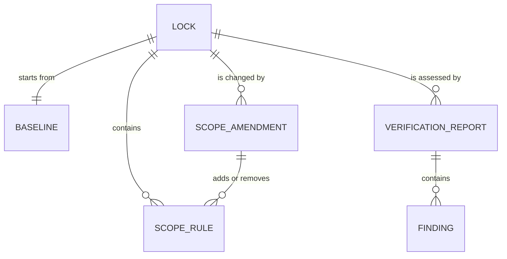
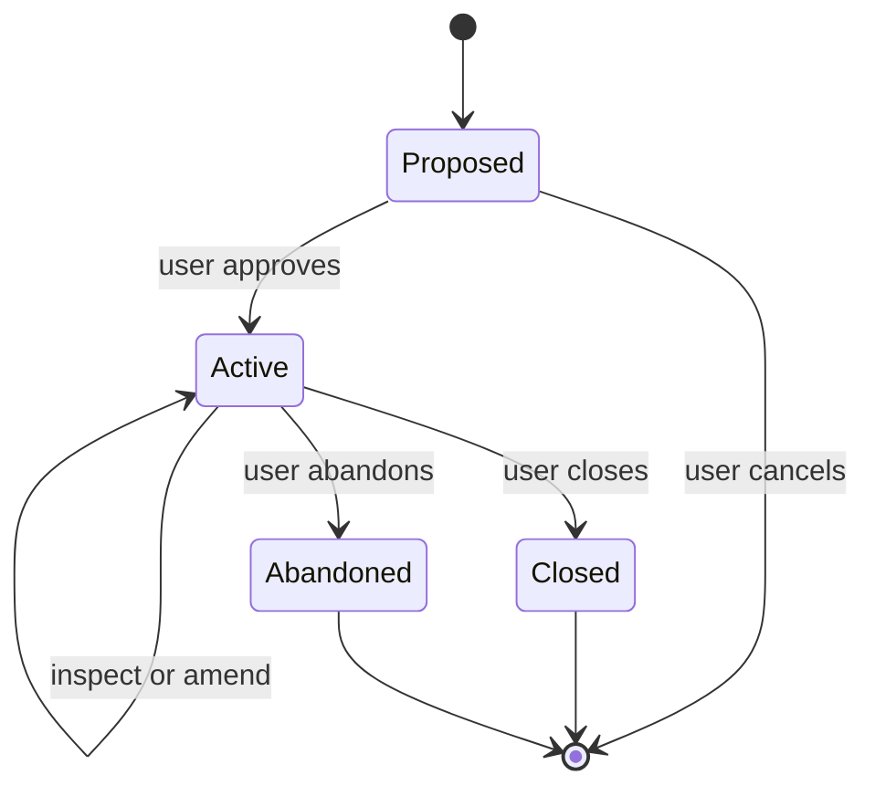

# Conceptual Model

The model is a product hypothesis based on the stated problem and current Codex behavior. Real-user testing may require revisions.

## Objects

### Lock

A persistent agreement describing one task boundary.

Attributes:

- Lock ID
- Format version
- Created timestamp
- Objective
- Allowed scope rules
- Forbidden scope rules
- Locked constraints
- Definition of done
- Validation requirements
- Baseline reference
- Lifecycle state

Actions:

- Propose
- Activate
- Inspect
- Amend
- Verify
- Close
- Abandon

### Scope rule

One approved path boundary inside a Lock.

Attributes:

- Kind: `allow` or `forbid`
- Project-relative path
- Match type: `file` or `directory`
- Reason
- Source: `initial` or an amendment ID
- Effective timestamp

Forbidden rules take precedence over allowed rules.

### Baseline

The accepted repository snapshot captured when a Lock becomes active.

Attributes:

- Repository kind
- Project and Git root relationship
- Branch state and name
- HEAD
- Index state
- Worktree state
- Pre-existing path observations
- Fingerprints
- Limitations
- Capture timestamp

The Baseline is immutable.

### Scope amendment

A separate, explicit record that changes active scope without rewriting the original Lock or Baseline.

Attributes:

- Amendment ID
- Lock ID
- Timestamp
- User-authorized reason
- Added rules
- Known findings that existed before the amendment

Actions:

- Approve
- Reject

An amendment cannot retroactively convert an already observed out-of-scope finding into an originally in-scope change.

The MVP supports only amendments that add allowed paths. Removing an allowed path or adding a forbidden path requires closing the current Lock and creating a new one.

### Finding

A comparison result for a repository path or repository-level condition.

Attributes:

- Category
- Evidence label
- Path or repository axis
- First observed time, when known
- Applicable rule
- Explanation
- Limitation

Findings are derived and appear in Status or a Verification report.

### Verification report

An immutable assessment of a Lock at a point in time.

Attributes:

- Report ID
- Lock ID
- Created timestamp
- Outcome
- Repository comparison
- Findings
- Validation evidence
- Limitations
- Recommended next action

Outcomes:

- `pass`
- `warning`
- `fail`
- `incomplete`

### Active pointer

An implementation record that identifies the currently active Lock. It is not a user-facing domain object and does not contain the authoritative contract.

## Relationships

## Lifecycle and health

Lifecycle and health are separate to avoid state explosion.

Lifecycle:

- `active`
- `closed`
- `abandoned`

Derived health:

- `clean`: no verified out-of-scope or stale condition.
- `attention`: one or more findings require review.
- `stale`: branch, HEAD, project root, or another baseline-critical fact changed.
- `unavailable`: storage or repository evidence could not be validated.

Verify produces a report. It does not close the Lock automatically.

## Ubiquitous language

| Chosen term | Meaning | Rejected alternatives |
|---|---|---|
| Lock | The approved task contract | Session, project, job |
| Scope rule | One allowed or forbidden path | Pattern, filter |
| Baseline | Starting repository evidence | Snapshot zero, initial diff |
| Amendment | Explicit scope change | Exception, override |
| Finding | A comparison result | Violation, offense |
| Verification report | Final evidence receipt | Release, audit |
| Close | End an active Lock intentionally | Release, unlock |

`Finding` is preferred over `violation` because authorship and timing may be uncertain.

## Late approval outcome

A `late-approved` finding is preserved as a finding category and limits the Verification report outcome to `warning`. It does not create another report-outcome enum.
