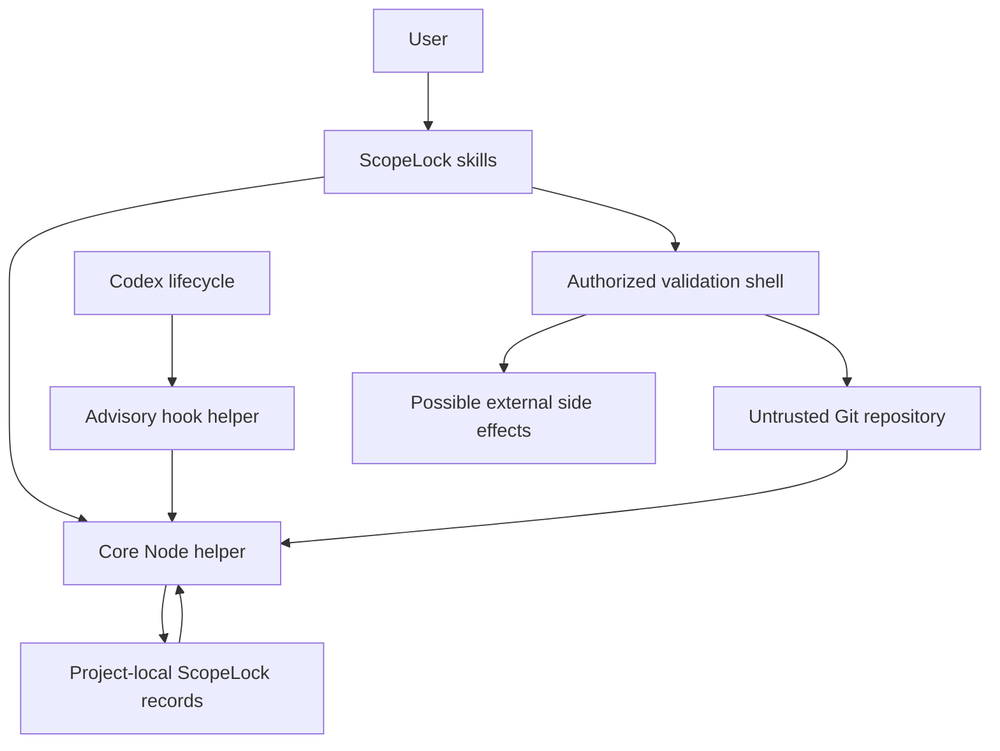

# ScopeLock Threat Model

## Executive summary

ScopeLock is an implemented, single-user, local Codex plugin that records an approved task boundary and compares later Git state with a project-local Baseline. The implementation has no service, account, authentication, telemetry, or built-in network client. The most important risks are filesystem escape, executable Git configuration, secret exposure during fingerprinting or validation, tampered local state, misleading advisory-hook semantics, and inconsistent evidence during concurrent repository or storage changes.

The Phase 3.5 review found no known critical vulnerability. High-risk implementation gaps found during the review were remediated: Git inspection now strips repository-control environment variables and disables side-effecting configuration, stored records receive strict structural validation, pointer updates use serialized compare-before-swap writes, and tracked-file hashing is bounded. Residual risks remain because project-local records have no external authenticity anchor and because an explicitly authorized validation command is a real shell command with the user's permissions.

True POSIX execution has not been run on this Windows host. Git Bash validates the POSIX hook command and quoting, but Linux or macOS filesystem and process semantics remain a release-verification gap.

## Scope and assumptions

In scope:

- `scripts/scopelock.mjs`, including Git inspection, path handling, storage, comparison, and validation execution
- `scripts/scopelock-hook.mjs` and `hooks/hooks.json`
- The three skill packages under `skills/`
- Project-local `.codex-scope/` records created by the helper
- The test suite and documented workflows

Out of scope:

- A compromised operating system or malicious administrator
- A malicious replacement of the installed ScopeLock package after the user trusts it
- Proof of human, process, or agent authorship for a repository change
- Protection of files outside the selected project root
- External effects caused by a validation command that the user explicitly authorizes

Confirmed assumptions:

- ScopeLock runs as the local user and is not an operating-system sandbox.
- Repository paths, metadata, links, attributes, contents, and `.codex-scope/` records may be malicious.
- The local Git executable, Node runtime, operating system, and user-managed global or system Git configuration are trusted environment components.
- Source trees may contain secrets.
- Untracked contents are never read or hashed by ScopeLock.
- Hooks are optional, explicitly trusted, advisory only, and may be disabled.
- Validation commands require separate authorization and may access the network or mutate files because they are ordinary local shell commands.
- An attacker who can rewrite all project-local ScopeLock records can also rewrite their project-local digests. ScopeLock can reject malformed or unsafe records but cannot establish external authenticity.

## System model

### Components

- Codex skills gather explicit task scope and invoke fixed helper commands.
- The core helper performs deterministic validation, Git inspection, comparison, storage, and reporting. Evidence: `scripts/scopelock.mjs:583`, `scripts/scopelock.mjs:1083`, and `scripts/scopelock.mjs:1217`.
- The hook helper reads bounded Codex hook JSON and emits advisory-only JSON. Evidence: `scripts/scopelock-hook.mjs:212` and `scripts/scopelock-hook.mjs:347`.
- Git and the local filesystem provide repository evidence.
- `.codex-scope/` stores an active pointer plus immutable contracts, Baselines, amendments, and reports.
- Explicitly authorized validation runs through the local shell. Evidence: `scripts/scopelock.mjs:1716`.

### Data flows and trust boundaries

- User to skill: objective, allowed paths, forbidden paths, constraints, and command authorization cross from user intent into plugin behavior.
- Repository to helper: untrusted Git metadata and paths cross into parsing and classification.
- Helper to filesystem: validated records are written under `.codex-scope/` with the user's permissions.
- Storage to helper: project-local records cross back into trusted comparison logic and must be validated again.
- Codex lifecycle to hook: lifecycle JSON crosses into a trusted local process, but its output is advisory.
- Verify to shell: an exact, separately authorized command crosses into an external process that can have arbitrary local side effects.

## Assets and security objectives

| Asset | Why it matters | Objective |
|---|---|---|
| User source and uncommitted work | Incorrect writes or cleanup can destroy valuable work | Integrity, availability |
| Lock contract and Baseline | They define the approved boundary and comparison origin | Integrity |
| Scope findings and verification evidence | Incorrect classification creates false confidence | Integrity |
| Repository secrets | Values must not appear in records or diagnostic output | Confidentiality |
| Codex workflow | Hooks and comparisons must remain bounded and optional | Availability |
| Installed plugin package | Trusted local code runs with user permissions | Confidentiality, integrity, availability |

## Attacker model

Capabilities:

- Control repository filenames, links, attributes, tracked content, untracked paths, nested repositories, submodules, and repository-local Git configuration.
- Corrupt or replace project-local `.codex-scope/` files.
- Cause concurrent changes through an editor, build, Git operation, or another agent.
- Create very large repositories, large files, unusual encodings, and rewritten Git history.
- Propose a dangerous validation command for the user to approve.

Non-capabilities:

- No assumed administrator or operating-system compromise.
- No ability to bypass filesystem permissions solely through ScopeLock.
- No built-in ScopeLock network endpoint to attack.
- No ability to turn advisory hooks into an operating-system write barrier.

## Entry points and attack surfaces

| Surface | Trust boundary | Security relevance | Evidence |
|---|---|---|---|
| Activate and Amend input | User to helper | Path traversal, overbroad scope, malicious text | `scripts/scopelock.mjs:583` |
| Git process environment and configuration | Repository or environment to Git child | Executable filters, fsmonitor, alternate repository selection, lazy network access | `scripts/scopelock.mjs:33`, `scripts/scopelock.mjs:225`, `scripts/scopelock.mjs:278` |
| Repository paths and links | Repository to filesystem helper | Boundary escape and encoding ambiguity | `scripts/scopelock.mjs:454`, `scripts/scopelock.mjs:656` |
| Active pointer and immutable records | Storage to helper | Wrong Lock selection, unsafe rules, forged evidence | `scripts/scopelock.mjs:791`, `scripts/scopelock.mjs:902`, `scripts/scopelock.mjs:1083` |
| Pointer replacement | Concurrent processes to storage | Lost update, torn state, stale writer lock | `scripts/scopelock.mjs:731` |
| Hook JSON | Codex to hook helper | Prompt noise, loops, false enforcement claims | `scripts/scopelock-hook.mjs:212`, `scripts/scopelock-hook.mjs:228` |
| Validation command | User to local shell | Arbitrary mutation, network access, sensitive output | `scripts/scopelock.mjs:1716`, `scripts/scopelock.mjs:1787` |

## Top abuse paths

1. A repository supplies a linked `.codex-scope/` directory or an escaping allowed path. ScopeLock follows it and reads or writes outside the project.
2. A repository-controlled Git environment or local config redirects inspection, launches a clean/process filter, invokes fsmonitor, or lazily fetches missing objects.
3. An attacker rewrites `baseline.json` and updates the digest in `active.json` to insert traversal or malformed scope rules.
4. Two ScopeLock processes read the same pointer and both publish updates, silently losing one amendment or report.
5. A large modified file or repository causes unbounded hashing or repeated expensive hook comparisons.
6. A branch switch, reset, rebase, or replacement object causes committed changes to be compared against the wrong history.
7. A user interprets a PreToolUse warning as proof that a write was blocked even though hooks are advisory.
8. An authorized validation command mutates out-of-scope files, exposes sensitive output, contacts a service, or leaves descendant processes running after timeout.
9. An attacker who controls every project-local ScopeLock record creates a semantically valid alternative Lock and matching digests.

## Threat model table

| ID | Threat | Impact | Controls and evidence | Residual gap | Priority |
|---|---|---|---|---|---|
| TM-001 | Path, symlink, junction, or reparse escape | Read or write outside the selected project | Root containment, realpath checks, no-follow hashing, safe storage creation at `scripts/scopelock.mjs:454` and `scripts/scopelock.mjs:656`; fixture at `tests/scopelock.test.mjs:362` | Same-user races cannot be made fully atomic across every parent path on every filesystem | High |
| TM-002 | Advisory warning is mistaken for enforcement | Unsafe changes proceed under false assurance | Hook output contains context only at `scripts/scopelock-hook.mjs:212`; advisory tests at `tests/hooks.test.mjs:158`, `tests/hooks.test.mjs:173`, `tests/hooks.test.mjs:212`, and `tests/hooks.test.mjs:235` | Product name still requires clear onboarding language | High |
| TM-003 | Secret-bearing content enters fingerprints or reports | Confidential data exposure | Untracked content is never opened; sensitive paths and files over 64 MiB are not hashed at `scripts/scopelock.mjs:454`; sanitization and fixtures cover validation output | Filename heuristics cannot recognize every sensitive tracked file; hashes still reveal equality | High |
| TM-004 | Malicious or corrupt storage changes scope | False clean result or unsafe path interpretation | Exact pointer, Baseline, amendment, and report path validation at `scripts/scopelock.mjs:791`, `scripts/scopelock.mjs:902`, and `scripts/scopelock.mjs:1083`; coordinated tamper fixture at `tests/scopelock.test.mjs:487` | A fully rewritten, structurally valid local record set has no external authenticity check | High |
| TM-005 | Repository changes during capture | False clean or wrong timing claim | Double capture, retry, and incomplete outcome at `scripts/scopelock.mjs:554`; fixture at `tests/scopelock.test.mjs:407` | Very active repositories may remain unavailable until writes settle | High |
| TM-006 | Branch or history manipulation | Missed committed drift | Same-branch ancestry checks, replacement refs disabled, and lazy fetch disabled; implementation starts at `scripts/scopelock.mjs:33` and comparison at `scripts/scopelock.mjs:1217` | Shallow or incomplete object stores can only yield stale or incomplete evidence | High |
| TM-007 | Authorized validation has dangerous side effects | File mutation, network effect, or secret exposure | Exact command authorization, bounded captured output, before/after comparison at `scripts/scopelock.mjs:1716` and `scripts/scopelock.mjs:1787` | Shell commands retain user permissions; best-effort timeout may not terminate every descendant process | High |
| TM-008 | Hook causes loops or excessive delay | Codex workflow denial of service | Timeouts in `hooks/hooks.json`, no Stop continuation field, hook-independent core workflows, hook fixtures | Large repository checks can still consume several seconds | Medium |
| TM-009 | Repository-controlled Git execution or redirection | Arbitrary command execution, wrong repository evidence, or implicit network access | Git environment stripping and command-scoped safe options at `scripts/scopelock.mjs:33` and `scripts/scopelock.mjs:225`; local filters fail closed at `scripts/scopelock.mjs:278`; fixtures at `tests/scopelock.test.mjs:443` and `tests/scopelock.test.mjs:473` | User-trusted global or system filter programs remain part of the trusted environment | High |
| TM-010 | Concurrent active pointer updates | Lost amendment, report, or close transition | Exclusive writer lock, expected digest, backup replacement, and stale-lock failure at `scripts/scopelock.mjs:731`; fixtures at `tests/scopelock.test.mjs:507` and `tests/scopelock.test.mjs:524` | A crash can leave a stale writer lock that requires manual review | Medium |
| TM-011 | Large or invalid repository data exhausts resources | Slow hooks or unavailable status | Git output capped at 64 MiB, JSON capped at 1 MiB, tracked hashing capped at 64 MiB, strict UTF-8 decode; fixtures at `tests/scopelock.test.mjs:537`, `tests/scopelock.test.mjs:564`, and `tests/scopelock.test.mjs:588` | True POSIX invalid-byte-path behavior is not yet executed on this host | Medium |

## Criticality calibration

Critical:

- ScopeLock enables remote code execution or credential exfiltration without separate user authorization.
- ScopeLock writes outside the selected project through an attacker-controlled path.

High:

- A verified out-of-scope change receives a clean pass.
- Secret values appear in a ScopeLock record or diagnostic because of automatic inspection.
- Repository-controlled Git configuration launches a command during Lock or Status.
- Rewritten history is treated as comparable.

Medium:

- Concurrent activity yields an explicitly incomplete result.
- A stale writer lock temporarily prevents a pointer update.
- Optional hooks cause bounded but noticeable delay.

Low:

- Cosmetic report ordering or wording does not change evidence meaning.

## Focus paths for security review

| Path | Focus |
|---|---|
| `scripts/scopelock.mjs:33` | Git child-process safety and side-effect suppression |
| `scripts/scopelock.mjs:454` | Secret-safe and bounded tracked-file hashing |
| `scripts/scopelock.mjs:583` | Scope path grammar and containment |
| `scripts/scopelock.mjs:656` | Storage root and link safety |
| `scripts/scopelock.mjs:731` | Serialized active pointer writes |
| `scripts/scopelock.mjs:791` | Pointer and immutable record validation |
| `scripts/scopelock.mjs:1217` | Repository comparison and stale-history behavior |
| `scripts/scopelock.mjs:1716` | Authorized shell execution and output handling |
| `scripts/scopelock-hook.mjs:212` | Advisory-only output contract |
| `tests/scopelock.test.mjs:443` | Hostile Git environment and storage fixtures |

## Quality check

- Every implemented entry point and trust boundary is represented.
- Threats distinguish repository-controlled data from the trusted local runtime and user environment.
- Controls cite implementation and fixture evidence.
- Residual risks are stated without treating advisory hooks or local digests as a security boundary.
- The POSIX verification gap is recorded as open rather than inferred from Windows behavior.
